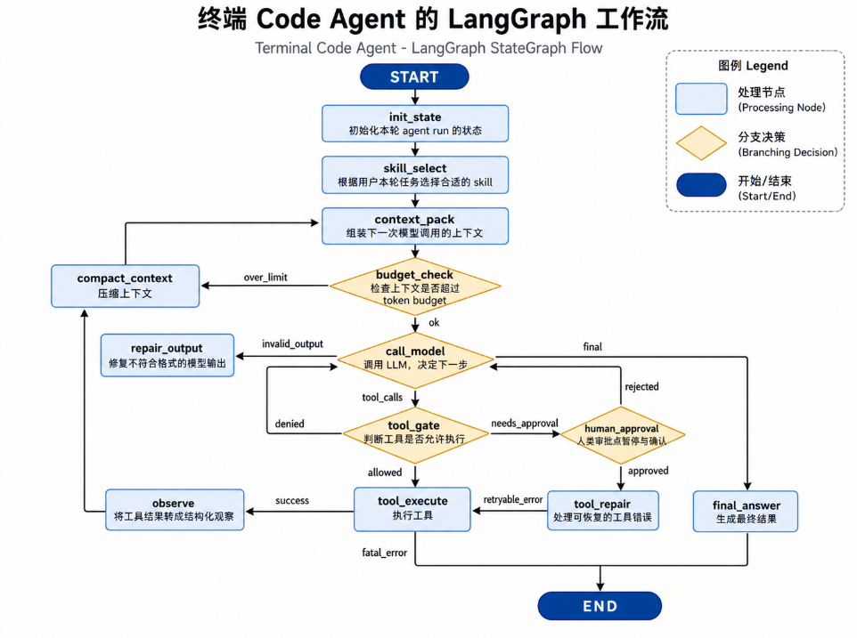

# Terminal Code Agent

> 一个运行在终端中的代码代理，基于 Python、LangChain、LangGraph 和 uv 构建。

Terminal Code Agent 把代码代理放进你熟悉的终端里：它可以读取项目文件、搜索代码、执行命令、应用补丁，并通过显式 LangGraph 工作流完成“规划 -> 工具调用 -> 观察 -> 修复 -> 最终回答”的循环。

项目默认把文件访问限制在启动时指定的 `--workdir` 内，并对写文件、打补丁、运行 shell 命令等高风险操作进行人工审批，适合用来探索、修改和维护本地代码仓库。

## ✨ 功能特性

- 🧠 **显式 LangGraph 工作流**：不依赖黑盒 ReAct agent，图节点和路由清晰可控。
- 🛠️ **终端代码工具集**：支持文件列表、搜索、读取、补丁、写文件和 shell 命令。
- 🔐 **人工审批机制**：`apply_patch`、`write_file`、`run_shell` 默认需要用户确认。
- 📁 **工作目录边界**：所有文件路径都会被限制在启动时指定的 `--workdir` 内。
- 💬 **会话恢复**：通过 SQLite checkpoint 保存对话状态，支持 `/resume <thread-id>` 恢复上下文。
- 🧾 **结构化日志**：每次 CLI 会话生成独立 JSONL 日志，方便调试和审计。

## 🎬 项目演示

演示视频位于 [docs/video/demo.mp4](docs/video/demo.mp4)。

如果你在 GitHub 页面中无法直接预览视频，可以点击上面的链接打开或下载查看。

## 🧭 图结构可视化

下面是项目的 LangGraph 图结构可视化：

<p align="center">
  
</p>

## 🚀 快速开始

### 1. 安装依赖

先安装 [uv](https://docs.astral.sh/uv/)，然后在项目根目录同步依赖：

```bash
uv sync
```

### 2. 配置模型凭据

复制配置文件并填写模型凭据：

```bash
cp .env.example .env
```

`MODEL_NAME` 填裸模型名，例如：

```env
MODEL_NAME=gpt-4.1-mini
```

OpenAI 或兼容 OpenAI API 的服务使用 `OPENAI_API_KEY`。兼容服务可同时配置
`MODEL_BASE_URL`，例如 DeepSeek：

```env
MODEL_NAME=deepseek-chat
MODEL_BASE_URL=https://api.deepseek.com/v1
OPENAI_API_KEY=你的_key
```

DeepSeek thinking 模式下，工具调用子轮会按官方建议回传 `reasoning_content`；
新用户轮次开始时会从历史上下文中清理旧的 `reasoning_content`。

项目不会硬编码密钥，也不会在日志中记录密钥内容。

### 3. 启动 CLI

```bash
uv run terminal-code-agent --workdir .
```

也可以通过模块入口运行：

```bash
uv run python -m terminal_code_agent --workdir .
```

启动后可以直接在终端中输入需求，例如：

```text
帮我查看项目结构
```

退出会话时输入：

```text
exit
```

或：

```text
quit
```

## ⚙️ 常用参数

- `--workdir`：必填，agent 可访问的工作目录。
- `--thread-id`：可选会话 ID；未指定时每次启动会自动生成新的 UUID。
- `--env-file`：配置文件路径，默认 `.env`。
- `--log-level`：覆盖配置中的日志级别。
- `--no-color`：禁用 Rich 彩色输出。

CLI 启动时会显示当前 `workdir`、`thread` 和日志文件路径。审批请求和最终回答会使用结构化终端面板展示。

## 💬 会话恢复

对话 state 会通过 SQLite checkpoint 自动保存到 `CHECKPOINT_DB`，默认路径为：

```text
.agent/checkpoints.sqlite
```

在交互过程中输入下面的命令，可以恢复已有会话上下文：

```text
/resume <thread-id>
```

恢复成功后，后续输入会继续写入该 thread。

## 🛠️ 工具能力

所有暴露给模型的工具都集中在 `src/terminal_code_agent/tools.py`，并使用 `@tool` 修饰：

| 工具 | 说明 |
| --- | --- |
| `list_files` | 查看目录结构。 |
| `search_files` | 按 glob 搜索文件名。 |
| `grep` | 搜索文本或正则命中。 |
| `read_file` | 读取文本文件，支持行号范围。 |
| `apply_patch` | 使用 unified diff 修改文件。 |
| `write_file` | 创建、覆盖或追加文件。 |
| `run_shell` | 在工作目录下运行 shell 命令。 |
| `load_skill_resource` | 读取 `skills/<skill_name>` 内资源。 |

## ✅ 人工审批

只读工具默认允许。`apply_patch`、`write_file`、`run_shell` 默认需要人工审批。

终端会展示工具名、参数摘要和风险说明，然后等待用户选择：

- `y` / `yes`：批准。
- `n` / `no`：拒绝。
- `edit`：编辑工具参数后批准。

审批由 LangGraph `interrupt()` 暂停，并通过 `Command(resume=...)` 恢复。工具函数内部不会调用 `input()`，审批流程统一由 CLI 驱动。

## 🔒 安全说明

本项目不是完整安全沙箱。当前安全策略主要用于降低误操作风险：

- 所有文件路径都会解析到 `--workdir` 内部，路径逃逸会被拒绝。
- `.env`、私钥、SSH key、云凭据、包管理凭据等敏感路径默认拒绝读取和写入。
- `run_shell` 固定在 `workdir` 中执行，并拒绝明显危险命令。
- 日志会脱敏并截断长文本。
- 工具失败会把错误类型、提示和关键 `stdout` / `stderr` 摘要反馈给后续修复步骤。

如果需要处理不可信仓库，建议在容器、虚拟机或受限用户下运行。

## 🧪 测试

运行完整测试：

```bash
uv run pytest
```

运行 lint：

```bash
uv run ruff check .
```

测试不依赖真实外部 LLM。模型相关流程使用 mock，或直接验证节点、路由、路径安全、token 预算和输出 schema。

## 📦 项目结构

```text
.
├── src/terminal_code_agent/   # 运行时代码
├── tests/                     # pytest 测试
├── docs/                      # 开发文档、演示视频和图结构图片
├── pyproject.toml             # 项目元数据、依赖和工具配置
├── uv.lock                    # uv 锁文件
└── README.md
```

关键模块：

- `graph.py`：显式 LangGraph 工作流。
- `tools.py`：暴露给模型的工具。
- `tool_gate.py`：工具审批策略。
- `tool_runtime.py`：工具运行时和路径安全。
- `schemas.py`：结构化输出 schema。
- `cli.py`：终端入口、审批交互和输出渲染。

## 📚 进一步阅读

- [docs/development.md](docs/development.md)：项目架构、设计约束和开发说明。
- [docs/video/demo.mp4](docs/video/demo.mp4)：项目演示视频。
- [docs/images/image.png](docs/images/image.png)：图结构可视化图片。

## ❓ 常见问题

**最终回答为什么是纯文本？**

当前最终输出契约只保留面向用户的回答文本。CLI 会将 `final_answer` 按 Markdown 渲染后打印。

**为什么写文件和运行命令都要审批？**

这些操作会修改真实工作目录或在本机执行命令，默认需要用户明确确认。

**能读取 `.env` 吗？**

不能。敏感路径默认拒绝，日志也不会记录密钥内容。

**这个项目适合直接处理不可信代码吗？**

不建议直接在宿主机处理不可信仓库。更稳妥的方式是在容器、虚拟机或受限用户下运行。
